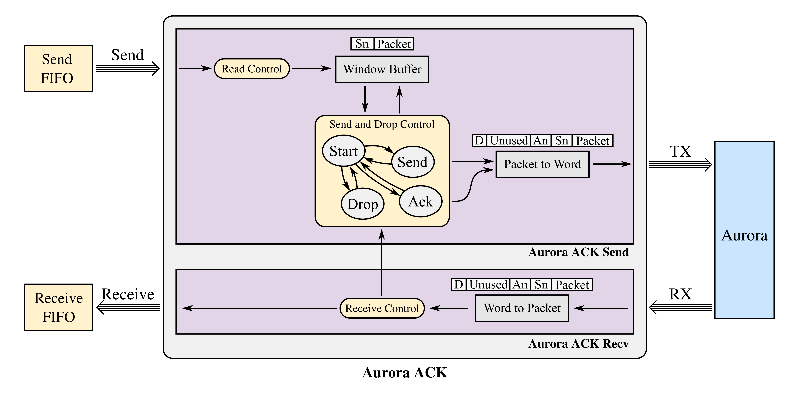
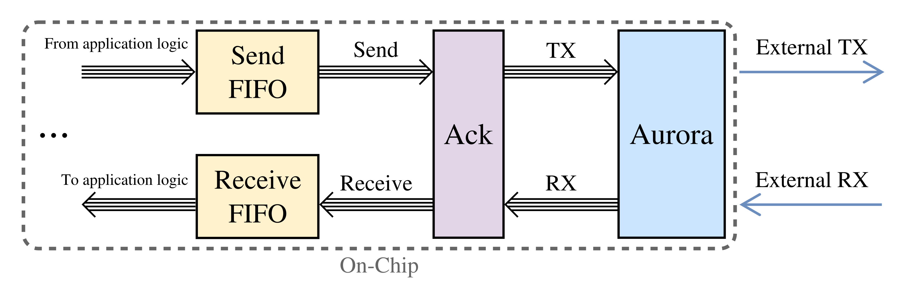
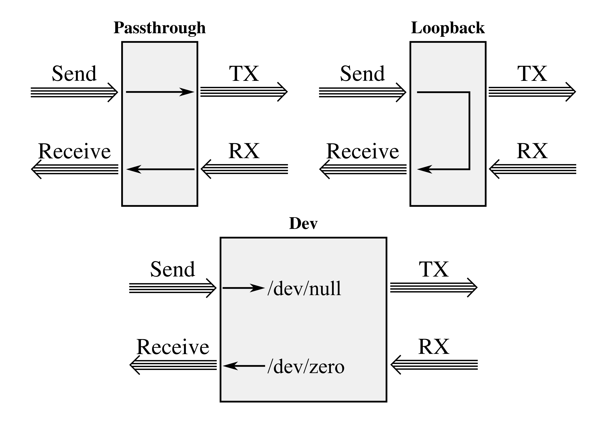

# Aurora ACK
Designed by Aaron Young

This repository contains a custom Aurora acknowledgment automatic repeat request design I created using VHDL for my PhD dissertation to make high-performance, robust, board-to-board communication possible via an [Aurora 8b10b](https://www.xilinx.com/products/intellectual-property/aurora8b10b.html) or an [Aurora 64b66b](https://www.xilinx.com/products/intellectual-property/aurora64b66b.html) channel. A detailed description of the design can be found in my dissertation available at **URL HERE** in Section 7.3.1. Aurora ACK implements a [go-back-n](https://en.wikipedia.org/wiki/Sliding_window_protocol) protocol with aggressive retransmission and flood control.


## Usage

The Aurora ACK module sits between an application FIFO and the Aurora IP component to provide high-performance, error-free communication over an Aurora channel using multi-gigabit transceivers. Aurora ACK was designed generically such that different sized communication packets could be used. Preliminary support for variable length packets is also included, but a max packet size (or frame size) must be provided to build the internal send window memory memory. The all of the communication busses use the [AXI4-Stream ARM AMBA protocol](https://static.docs.arm.com/ihi0051/a/IHI0051A_amba4_axi4_stream_v1_0_protocol_spec.pdf). The VHDL source files for this component can be found in `src/`. All of the VHDL files are needed for the design. The top-level entity is in `src/aurora_ack.vhd`. The component can be instantiate as follows.

```vhdl
aurora_ack_i : entity work.aurora_ack(Behavioral)
generic map (
    WORD_SIZE          => 64,
    FRAME_WIDTH        => 512,

    MAX_FLOOD          => 2,
    FLOOD_WAIT         => 100,
    NEW_PACKET_RESETS  => TRUE
)
port map (
    clk    => user_clk,
    rst_n  => reset_pcie_n,

    -- TX Stream Interface
    m_axi_tx_tdata          => ack_m_axi_tx_tdata_i,
    m_axi_tx_tvalid         => ack_m_axi_tx_tvalid_i,
    m_axi_tx_tready         => ack_m_axi_tx_tready_i,
    m_axi_tx_tkeep          => ack_m_axi_tx_tkeep_i,
    m_axi_tx_tlast          => ack_m_axi_tx_tlast_i,

    -- RX Stream Interface
    s_axi_rx_tdata          => ack_s_axi_rx_tdata_i,
    s_axi_rx_tkeep          => ack_s_axi_rx_tkeep_i,
    s_axi_rx_tvalid         => ack_s_axi_rx_tvalid_i,
    s_axi_rx_tlast          => ack_s_axi_rx_tlast_i,

    -- Send Stream Interface
    s_axi_send_tdata        => ack_s_axi_send_tdata_i,
    s_axi_send_tready       => ack_s_axi_send_tready_i,
    s_axi_send_tvalid       => ack_s_axi_send_tvalid_i,

    -- Receive Stream Interface
    m_axi_recv_tdata        => ack_m_axi_recv_tdata_i,
    m_axi_recv_tvalid       => ack_m_axi_recv_tvalid_i,
    m_axi_recv_tready       => ack_m_axi_recv_tready_i,

    -- Receive CRC
    crc_pass_fail_n         => crc_pass_fail_n_i,
    crc_valid               => crc_valid_i
);
```

The following table shows the customizable Aurora ACK generics.

| Generic           | Default Value | Description                                                                                                                                                                |
|-------------------|---------------|----------------------------------------------------------------------------------------------------------------------------------------------------------------------------|
| WORD_SIZE         | 32            | Size for each word used by Aurora. Supports word sizes of 32, 64, 128.                                                                                                     |
| FRAME_WIDTH       | 512           | Max size for each packet and also the Aurora frame size. Supports sizes which are a multiple of the word size.                                                             |
| MAX_FLOOD         | 2             | Max number of retransmissions before waiting FLOOD_WAIT cycles. Supports any positive number.                                                                              |
| FLOOD_WAIT        | 100           | Number of cycles to wait after the MAX_FLOOD number of retransmissions. Supports any positive number.                                                                      |
| NEW_PACKET_RESETS | TRUE          | Does a new packet to send reset waiting for the FLOOD_WAIT time? If TRUE, the counter is reset. If false, the new packet is still sent, but then the flood wait continues. |

In addition to the main behavioral architecture of Aurora ACK there are also three additional debugging and testing architectures included in the `aurora_ack.vhd` file. These architectures implement a passthough without retransmission, loopback which receives whatever is sent, and dev which discards what is sent and always receives packets filled with zeros. 


## Testbenches
Test benches for the various components can be found in the `testbench` folder. All of the testbenches were originally used with [Xilinx Vivado](https://www.xilinx.com/products/design-tools/vivado.html), but must of the test benches can also be run with the open-source [GHDL](http://ghdl.free.fr/) simulator. A [Python 3](https://www.python.org/) script is provided in `scripts/` to make running the testbenches with GHDL easier. GHDL can also generate VCD waveform files which can be opened using the open-source [GTKWave](http://gtkwave.sourceforge.net/). The only testbench which cannot be ran with GHDL is `aurora_ack_tb.vhd` which uses an [aurora_64b66b](https://www.xilinx.com/products/intellectual-property/aurora64b66b.html) component with aurora ack to perform higher level testing. This testbench can be simulated with Vivado after first creating an Aurora component.
